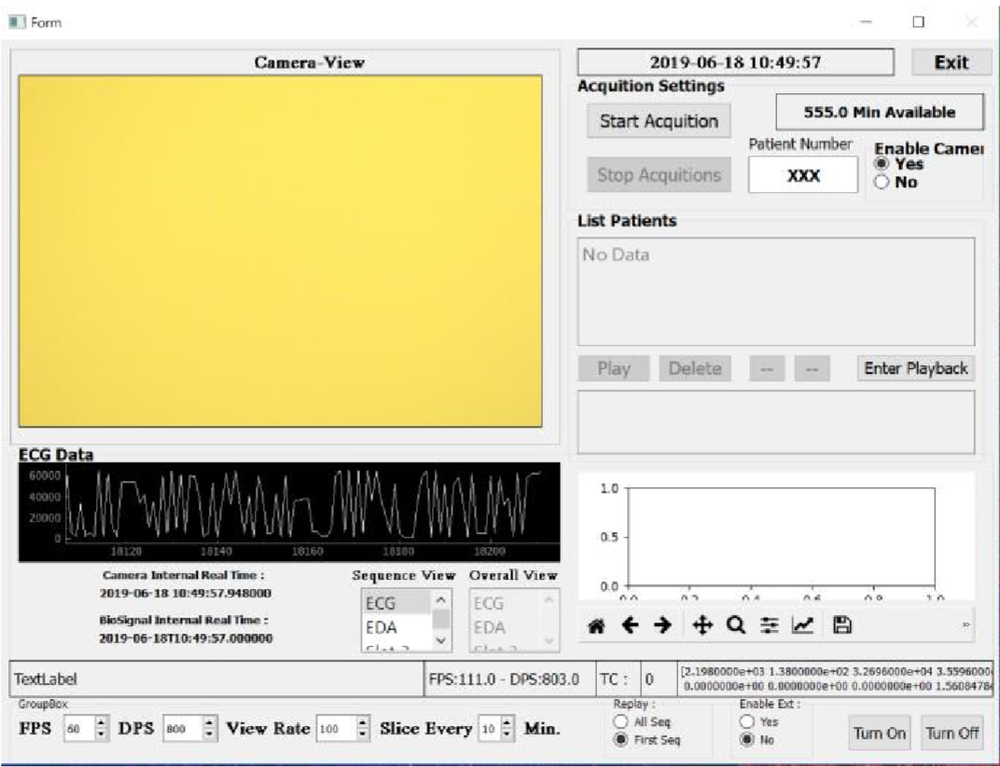

# Bio-Acquisition
[Software] This is the Repository of our Bio-medical data acquisition (ECG-EDA + Camera) software. It is purely implemented using python + QT

Specs : 
  1. Python 2.7 based
  2. Record ECG-EDA (max 2 Khz)
  3. Camera (max 120 fps)
  4. Multi-Threading Supports
  5. Real time visualization

screenshoot : 

Manual : manual.odt

Libraries needed : 
  1. Pylon for the camera : https://github.com/basler/pypylon
  2. Biosignal plux api (python) : https://www.biosignalsplux.com/downloads/api/PLUX_API_Python2.7.zip
  3. QT libraries (pyqt4) : https://pypi.org/project/PyQt4/
  
1. The main file is viewer.py which can be evoked directly : python viewer.py
2. The viewer.ui is the designer file which you can edit via pyqt designer (or pyqt creator). 
3. configurations : 
    1. meta.txt : change in to 0 when you want to refresh the counter 
    2. config.py : change the parameters to suit your need. 
    
License : standard GPL. 

If you find this useful, you may cite our paper which used this acqusition tools : 

@misc{comas2019endtoend,
    title={End-to-end facial and physiological model for Affective Computing and applications},
    author={Joaquim Comas and Decky Aspandi and Xavier Binefa},
    year={2019},
    eprint={1912.04711},
    archivePrefix={arXiv},
    primaryClass={cs.CV}
}
